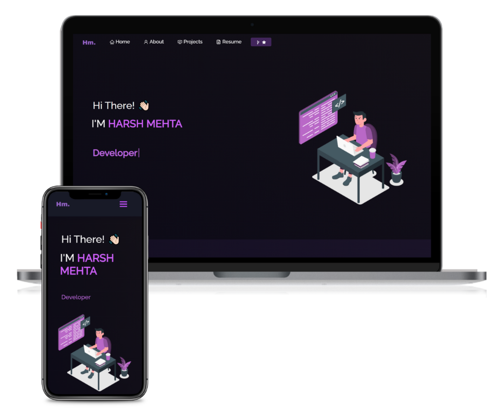

<h2 align="center">
  Portfolio Website 
  
</h2>

  

 

 &nbsp;
 &nbsp;
 &nbsp;
 &nbsp;

<h3 align="center">
    🔹
    <a href="https://github.com/harshmehta813/Portfolio/issues">Report Bug</a> &nbsp; &nbsp;
    🔹
    <a href="https://github.com/harshmehta813/Portfolio/issues">Request Feature</a>
</h3>

## Built With

My personal portfolio  which features some of my github projects as well as my resume and technical skills. 

This project was built using these technologies.

- React.js
- CSS3
- Html
- js
- VsCode

